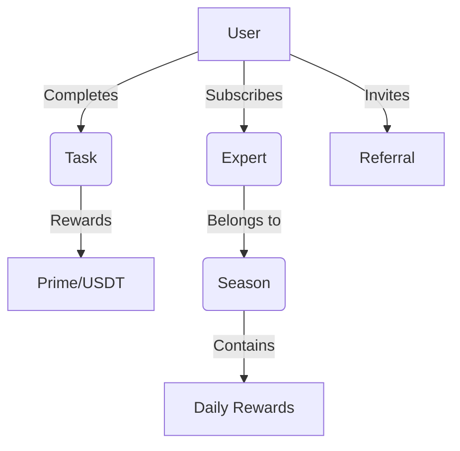

### **Полный отчет по проекту**

---

#### **1. Общее описание бизнес-логики**
Проект представляет собой **Telegram-ориентированную платформу** для управления подписками на экспертов, задачами, вознаграждениями и реферальными программами. Ключевые функции:
- **Геймификация**: Задачи с наградами (Prime/USDT), ежедневные награды, серии (streak).
- **Экспертная система**: Подписки на контент-создателей в рамках сезонов.
- **Реферальная программа**: Привлечение пользователей с вознаграждениями.
- **Администрирование**: Управление пользователями, задачами, экспертами через API.

---

#### **2. Модели данных (ORM)**
| Файл              | Описание                                                                                     |
|-------------------|---------------------------------------------------------------------------------------------|
| `user.py`         | Пользователи: балансы (Prime/USDT), Telegram ID, аватар, статус обучения.                   |
| `expert.py`       | Эксперты: имя, Telegram-канал, описание, аватар, специализация (`activity_type`).           |
| `season.py`       | Сезоны: период активности (даты начала/окончания), связь с экспертами.                     |
| `subscription.py` | Подписки пользователей на экспертов в рамках сезона.                                        |
| `task.py`         | Задачи: типы (`main`, `media`, `friends` и др.), награды, целевые показатели (например, кол-во рефералов). |
| `rewarding.py`    | Ежедневные награды: учет серий (streak), дата последнего получения.                         |
| `ref.py`          | Реферальные связи: кто кого пригласил.                                                      |
| `admin.py`        | Администраторы: логин, хеш пароля.                                                          |

---

#### **3. API-эндпоинты**
Группировка по функционалу:

##### **Пользователи (`users.py`)**
- `POST /create/` — Регистрация с проверкой подписи Telegram WebApp.
- `GET /{telegram_id}/` — Получение данных пользователя.
- `PATCH /{telegram_id}/` — Обновление балансов или статуса обучения.

##### **Задачи (`task.py`)**
- `GET /` — Список задач с отметкой о выполнении.
- `GET /statuses/` — Статусы задач по типам (например, все ли `friends` задачи выполнены).
- `POST /complete/{type}/` — Завершение задачи (проверяет условия, например, подписку на канал для `media`).

##### **Эксперты (`experts.py`)**
- `GET /{id}/` — Данные эксперта.
- `GET /` — Список экспертов с пагинацией.

##### **Сезоны (`seasons.py`)**
- `GET /current/season/` — Активный сезон (на основе текущей даты).
- `GET /current/folder/` — URL папки экспертов в Telegram.

##### **Рефералы (`refs.py`)**
- `POST /create/` — Регистрация реферальной связи.
- `GET /number/` — Количество приглашенных пользователей.
- `GET /users/` — Список приглашенных.

##### **Вознаграждения (`rewardings.py`)**
- `GET /status/` — Текущий streak и доступные награды.
- `POST /update/` — Получение ежедневной награды (если доступно).

##### **Статистика (`statistics.py`)**
- `GET /referrals/claimed/` — Заработанные Prime/USDT за рефералов.
- `GET /referrals/available/` — Доступные, но не полученные награды.

##### **Подписки (`subscribe.py`)**
- `POST /` — Проверка подписки на каналы экспертов.
- `POST /notify/` — Уведомление пользователя после добавления папки.

---

#### **4. Интеграции**
- **Telegram API**: 
  - Проверка подписок на каналы (`getChatMember`).
  - Отправка уведомлений (`sendMessage`).
- **WebApp**: Аутентификация через подпись Telegram (`check_webapp_signature`).

---

#### **5. Особенности**
- **Telegram-first**: Использование `telegram_id` как основного идентификатора.
- **Сезонность**: Ограниченные периоды активности экспертов.
- **Гибкие задачи**: Разные типы с уникальными условиями выполнения.
- **Безопасность**: Валидация подписей Telegram для критичных действий.

---

#### **6. Схема взаимодействия**


---

#### **7. Примеры запросов**
- **Создание пользователя**:
  ```http
  POST /users/create/
  Body: {"init_data": "Telegram_WebApp_Data", "username": "john_doe"}
  ```

- **Получение текущего сезона**:
  ```http
  GET /seasons/current/season/
  ```

- **Завершение задачи**:
  ```http
  POST /tasks/complete/friends/
  Body: {"task_id": "uuid"}
  ```

---

Этот отчет охватывает все ключевые компоненты системы, от моделей данных до бизнес-логики API. Если нужно углубиться в конкретный модуль — дайте знать!
